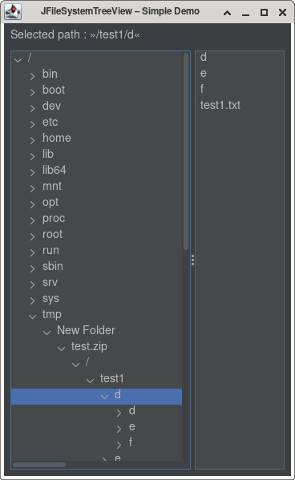

# lib-filesystem-view


This directory contains the modules of the `lib-filesystem-view` library consisting of the modules:

  * `lib-filesystem-view-base`
  * `lib-filesystem-view-fx`
  * `lib-filesystem-view-swing`

#### Maven coordinates

Releases are available at:

```
de.bernd-michaely:lib-filesystem-view-base:${version}
de.bernd-michaely:lib-filesystem-view-fx:${version}
de.bernd-michaely:lib-filesystem-view-swing:${version}
```

`lib-filesystem-view` is a Java library to provide a tree view of a FileSystem in the user interface of a desktop application.



The library provides the basic functionality one would expect from such a library, as well as some **advanced features**, in particular:

  * Integration of a filesystem **watch service**:
    * if a directory is displayed and expanded in the current view, and a new sub-directory will be created externally in the filesystem, this will be detected and a new sub-directory entry will be created
    * if a sub-directory which is currently displayed in the view will be removed externally in the filesystem, it will be automatically removed from the view.
  * **High configurability**: by providing a custom implementation of an interface, the behavior of the component can be controlled in a detailed way.

The latter point allows e.g. to:

  * mount a virtual inline view of an **embedded filesystem**, e.g. the contents of an archive file (see the `test1.zip` and `test2.zip` files in the screenshot)
  * treat some particular directories conceptually as **leaf nodes**, that is it is not possible to descend into such directories. An application might want to hide the physical sub-directory structure of directories like `DCIM`, `.svn`, `.git` and the like and provide its own logical view instead
  * control the display of hidden directories.

## Prerequisites

To build the project or run the demo apps, you need a JDK installed (at least JDK17 or compatible). Tu use any of the `-swing` or `-fx` modules, you need to get the `-base` module before. (The library is mainly developed on Linux and tested on Linux and Windows.)

### Minimum Java versions

To use the `-base` or the `-swing` module, Java 21 is needed at minimum, the `-fx` module needs at minimum Java 25.

To run the `gradlew` Gradle wrapper, currently a JDK 17 is needed at minimum (it will download a suitable tool-chain and cache it locally, if none can be found on the system).

## Demo Apps

The sub-directories of the `-swing` and `-fx` modules contain simple demo applications. To try them, get the sources, go to the sub-directory and run:

`> ./gradlew runDemo`

For the `-swing` version, there is also the script `FilesystemViewSwingDemo.groovy`, which can be used as demo or template.

## Using the libraries

Basically, use the factory methods of the main interfaces to create a new instance, that is

`JFileSystemTreeView.createInstance()` for the `-swing` version or

`FileSystemTreeView.createInstance()` for the `-fx` version.

The `createInstance()` methods optionally take a `Configuration` argument, which can be configured via the `builder()`. Most enhanced configuration options then can be provided by passing an implementation of the `UserNodeConfiguration` interface.

The detailed usage is described in a separate document [USAGE.md](USAGE.md) and the [GitHub Wiki](https://github.com/berndmichaely/lib-filesystem-view/wiki).
