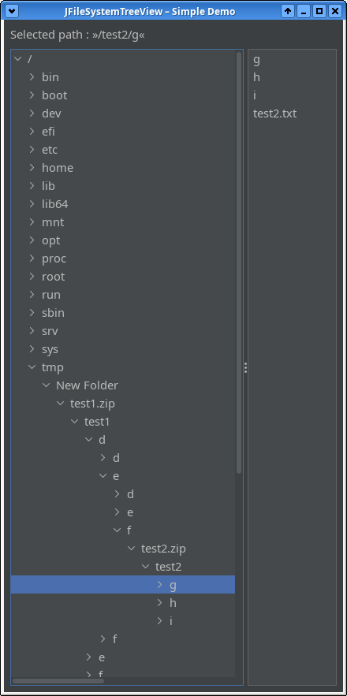

# [lib-filesystem-view](https://github.com/berndmichaely/jem/lib-common/lib-filesystem-view)

by [Bernd Michaely](https://bernd-michaely.de/en)

This directory contains the modules of the `lib-filesystem-view` library consisting of the modules:

* `lib-filesystem-view-base`
* `lib-filesystem-view-fx`
* `lib-filesystem-view-swing`

`lib-filesystem-view` is a Java library to provide a tree view of a FileSystem in the user interface of a desktop application.

The library provides the basic functionality one would expect from such a library, as well as some **advanced features**, in particular:

* Integration of a filesystem **watch service**:
    * if a directory is displayed and expanded in the current view, and a new subdirectory will be created externally in the filesystem, this will be detected and a new subdirectory entry will be created
    * if a subdirectory which is currently displayed in the view will be removed externally in the filesystem, it will be automatically removed from the view.
* **High configurability**: by providing a custom implementation of an interface, the behaviour of the component can be controlled in a detailed way.

The latter point allows e.g. to:

* mount a virtual inline view of an **embedded filesystem**, e.g. the contents of an archive file (see the `test.zip` file in the screenshot)
* treat some particular directories conceptually as **leaf nodes**, that is it is not possible to descend into such directories. An application might want to hide the physical subdirectory structure of directories like `DCIM`, `.svn`, `.git` and the like and provide its own logical view instead
* control the display of hidden directories.

## Demo Apps

The subdirectories of the `-swing` and `-fx` modules contain simple demo applications. To try them, have a JDK 17 installed, get the sources and run from the root directory:

`> ./gradlew runDemo`

## Getting the libraries

Have a JDK 17 installed and get the sources of the `-base` module and any of the `-swing` or `-fx` modules. Then for each, the `-base` module first, run from the root directory:

`> ./gradlew publishToMavenLocal`

## Using the libraries

Basically, use the factory methods of the main interfaces to create a new instance, that is

`JFileSystemTreeView.createInstance()` for the `-swing` version or

`FileSystemTreeView.createInstance()` for the `-fx` version.

The `createInstance()` methods optionally take a `Configuration` argument, which can be configured via the `builder()`. Most enhanced configuration options then can be provided by passing an implementation of the `UserNodeConfiguration` interface.

The detailed usage is described in a separate document [USAGE.md](USAGE.md).

## Current Status

Early access.

Basic functionality should work, for enhanced features not everything is working yet.
